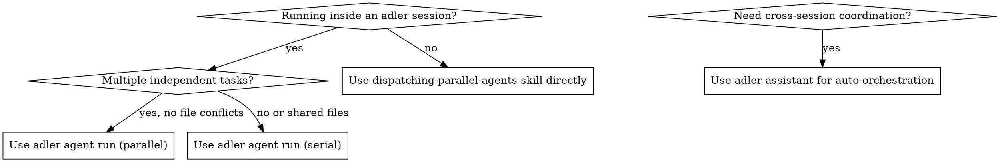

# Using Adler Subagents

## Overview

Adler is an agent orchestrator with a CLI, daemon, and TUI dashboard. It manages sessions that track agents, context, logs, and workflow state. Agents are spawned non-blocking and tracked by name so you can wait for them and read their output when ready.

**Core principle:** Spawn agents non-blocking, coordinate with `wait`, retrieve results with `read`.

**Project root:** `bun run adler` invokes the CLI from the repo root.

## Prerequisites

An active session is required before running agents.

```bash
# Check for an active session
adler session list
# or check .adler/.session for session id

# Create a session if needed
adler new
adler new --goal "Implement payment feature"
```

Session is auto-resolved from (highest to lowest priority):
1. `--session <id>` flag
2. `ADLER_SESSION` env var
3. `.adler/.session` file

## Core Commands

### Spawn a non-blocking agent

```bash
adler agent run \
  --agent <agent-type> \
  --name <unique-name> \
  "<prompt>"
```

- `--agent`: agent type, e.g. `opencode:build`, `opencode:plan`, `echo`
- `--name`: unique identifier used to reference this agent later (auto-generated if omitted)
- Returns the span ID immediately — the agent runs in the background

```bash
# Example: run a planning agent non-blocking
adler agent run --agent opencode:plan --name "planner" "Research and create an implementation plan for the auth feature"
```

### Block until agent finishes

```bash
adler agent wait --name <name>
# Outputs: the agent's final status (e.g. "completed", "failed")
```

### Read agent output

```bash
adler agent read --name <name>
# Outputs: agent's text output, or file path if output was written to a file
```

### Check agent status (non-blocking)

```bash
adler agent status --name <name>
# Returns current status without blocking
```

### List all agents in session

```bash
adler agent list
# Outputs: id, name, status for each agent
```

## Parallel Agent Coordination

The key pattern: spawn all independent agents first, then wait and read in order.

```bash
# 1. Spawn multiple agents (all non-blocking)
adler agent run --agent opencode:build --name "auth-impl" "Implement JWT authentication"
adler agent run --agent opencode:build --name "db-schema" "Create database schema for users table"
adler agent run --agent opencode:build --name "api-routes" "Add REST API routes for auth endpoints"

# 2. Wait for each to complete
adler agent wait --name "auth-impl"
adler agent wait --name "db-schema"
adler agent wait --name "api-routes"

# 3. Read outputs
adler agent read --name "auth-impl"
adler agent read --name "db-schema"
adler agent read --name "api-routes"
```

**When agents can run in parallel:** independent domains, no shared state, no file conflicts.

**When to serialize:** agents that depend on each other's output, or that edit overlapping files.

## Environment Variables Passed to Agents

Every agent spawned via `adler agent run` automatically receives:

| Variable | Value |
|----------|-------|
| `ADLER_SESSION` | Current session ID |
| `ADLER_AGENT_PROMPT` | The prompt passed to the agent |
| `ADLER_CONTEXT` | JSON dump of all session context items |

Agents can use `ADLER_SESSION` to call back into adler (e.g., to add context or log).

## Configuring Agent Types

Agent types are defined in `adler.ts` (project: `.adler/adler.ts`, global: `~/.config/adler/adler.ts`):

```ts
const config: AdlerConfig = {
  agent: {
    agents: {
      // Simple: returns a shell command string
      echo: ({ prompt }) => `echo ${prompt}`,

      // Realistic: run opencode with a specific subagent
      opencode: ({ prompt, subagent }) =>
        `opencode run --agent ${subagent} "${prompt}"`,
    }
  }
}
```

Call with colon notation: `--agent opencode:build` passes `subagent="build"` to the factory.

Use the `@adler/opencode` plugin for pre-built opencode agent definitions:

```ts
const config: AdlerConfig = {
  plugins: ["@adler/opencode"],
}
```

## When to Use vs. Other Approaches



| Situation | Use |
|-----------|-----|
| Inside adler session, tasks independent | `adler agent run` (parallel, then wait) |
| Inside adler session, tasks dependent | `adler agent run` (serial, wait between) |
| No adler session, tasks independent | `dispatching-parallel-agents` skill |
| Need full auto-orchestration | `adler assistant --auto` |
| Need session observability/TUI | adler (this skill) |

## Quick Reference

```bash
# Session setup
adler new                                  # Create session
adler new --goal "Build X"                 # Session with goal
adler session list                         # List sessions

# Agent lifecycle
adler agent run --agent <type> --name <n> "<prompt>"  # Spawn (non-blocking)
adler agent wait --name <name>             # Block until done
adler agent read --name <name>             # Get output
adler agent status --name <name>           # Check status (non-blocking)
adler agent list                           # List all agents

# Context
adler context add --type url --label "docs" https://example.com
adler context add --type file --label "spec" ./spec.md
adler context list

# Workflows
adler run my-workflow                      # Run defined workflow

# Assistant
adler assistant "what happened so far?"    # Query session
adler assistant --auto "finish workflow"   # Auto-orchestrate
```

## Common Mistakes

**Forgetting `--name`:** Without a name, auto-generated names make it hard to `wait` and `read` later. Always provide `--name` when you need to reference the agent.

**Spawning dependent agents in parallel:** If agent B needs agent A's output, spawn A, `wait`, `read`, then spawn B with A's output embedded in the prompt.

**No active session:** `adler agent run` requires an active session. If it errors, run `adler new` first.

**File conflicts in parallel agents:** Agents editing the same files simultaneously cause conflicts. Serialize agents that touch overlapping code paths.

**Not reading output after wait:** `wait` only blocks and returns status. Call `read` separately to get the actual output content.

## Red Flags

- Calling `adler agent wait` before `adler agent run` — nothing to wait for
- Running parallel agents that edit the same files — causes merge conflicts
- Skipping `--name` on agents you need to reference — use auto-generated IDs only if you don't need to wait/read
- Embedding large outputs in follow-up prompts without summarizing — keep agent context lean
